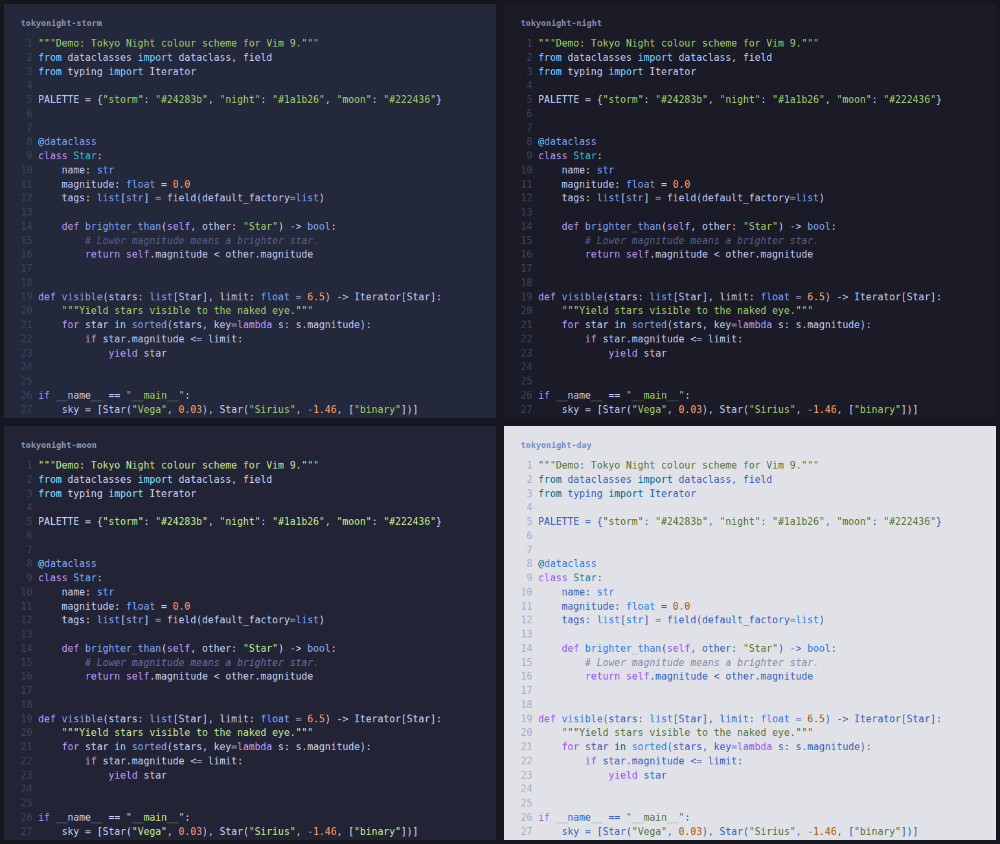

# tokyonight-vim9

A clean, dark Vim colour scheme — a pure **vim9script** port of
[folke/tokyonight.nvim](https://github.com/folke/tokyonight.nvim), with no Lua
or Neovim required.



## Features

- Four styles: **storm**, **night**, **moon** (dark) and **day** (light)
- Palettes copied verbatim from the upstream Lua sources; the `day` palette and
  brightened terminal colours are pre-computed (HSLuv is too heavy for runtime
  Vimscript)
- Terminal (`:terminal`) colours included
- A matching [lightline.vim](https://github.com/itchyny/lightline.vim) theme

## Requirements

- Vim 9.0+
- `termguicolors` (a true-colour terminal, or the GUI)

## Installation

With [vim-plug](https://github.com/junegunn/vim-plug):

```vim
Plug 'enescala/tokyonight-vim9'
```

Or copy `colors/` and `autoload/` into your `~/.vim`.

## Usage

```vim
set termguicolors

" pick a style directly...
colorscheme tokyonight-storm   " or -night / -moon / -day

" ...or use the default entry point
let g:tokyonight_style = 'storm'        " storm | night | moon | day (default: moon)
let g:tokyonight_light_style = 'day'    " used when 'background' is light
colorscheme tokyonight
```

For the lightline theme:

```vim
let g:lightline = { 'colorscheme': 'tokyonight' }
```

## Credits

All design credit goes to [@folke](https://github.com/folke) —
this is a faithful port of
[tokyonight.nvim](https://github.com/folke/tokyonight.nvim) to vim9script.

## License

[Apache-2.0](LICENSE), same as upstream.
